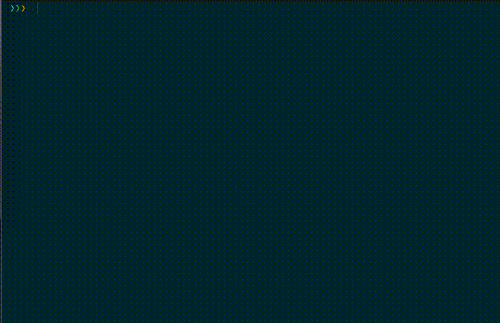

seeeye (CI/CD toolkits for mobile apps)
=======================================

.. _readthedocs: https://seeeye.readthedocs.io/
.. _contributing guidelines: https://seeeye.readthedocs.io/en/latest/contributing.html
.. _fastlane: https://fastlane.tools
.. _FAQ: https://seeeye.readthedocs.io/en/latest/faq.html#python-setup

.. image:: https://github.com/trinhngocthuyen/seeeye/workflows/test/badge.svg
    :target: https://github.com/trinhngocthuyen/seeeye/actions/workflows/test.yml

.. image:: https://img.shields.io/pypi/v/seeeye.svg
    :target: https://pypi.org/project/seeeye

.. image:: https://codecov.io/gh/trinhngocthuyen/seeeye/branch/main/graph/badge.svg
    :target: https://codecov.io/gh/trinhngocthuyen/seeeye

.. image:: https://img.shields.io/pypi/l/seeeye.svg
    :target: https://github.com/trinhngocthuyen/seeeye/blob/main/LICENSE

``seeeye`` is a Python package providing various CI/CD toolkits for mobile projects, especially iOS projects. While many iOS projects favor fastlane_, this package attempts to brings convenient usages to projects where Python is the favorable choice for scripting.

Installation
------------

``seeeye`` is `available on PyPI (Python Package Index)
<https://pypi.org/project/seeeye>`_. You can install with with ``pip``:

.. code-block:: console

   $ pip install --upgrade seeeye

First time hearing ``pip``? Check this `FAQ`_.

Getting Started
---------------

Check this out: `Getting Started <https://seeeye.readthedocs.io/en/latest/getting_started/index.html>`_ 🎉.

Documentation
-------------

Kindly check out the related docs on readthedocs_:

- `API Reference <https://seeeye.readthedocs.io/en/latest/api/reference.html>`_

.. Supported CI/CD Providers
.. -------------------------

.. - [x] Github Actions
.. - [ ] CircleCI (planning)
.. - [ ] Gitlab CI/CD (planning)

Contributing
------------

Refer to the `contributing guidelines`_ for how to contribute to this project.
